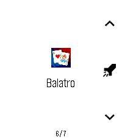
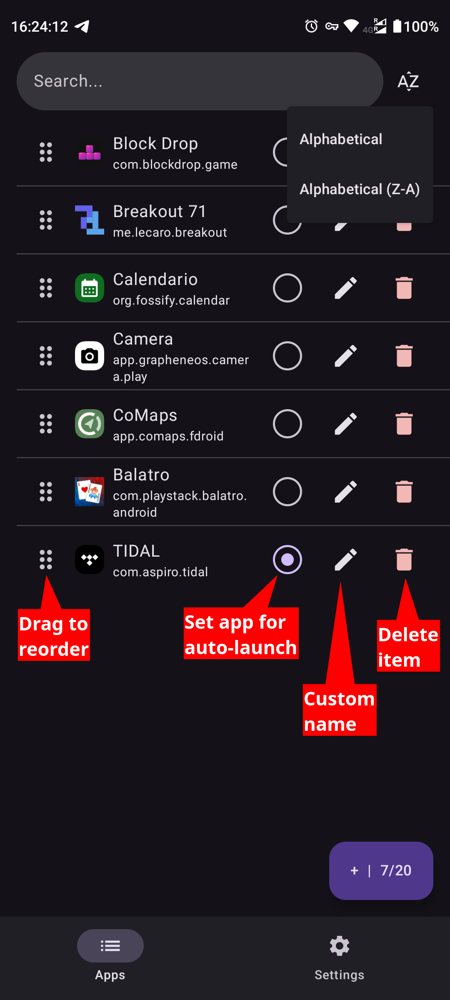
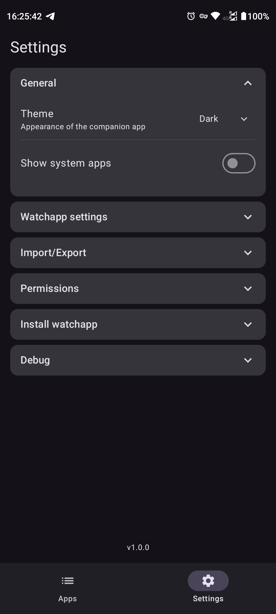
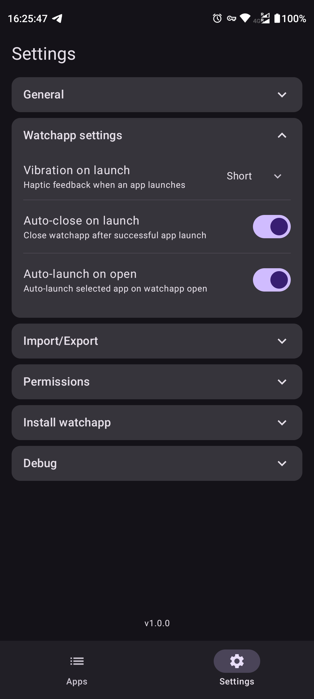
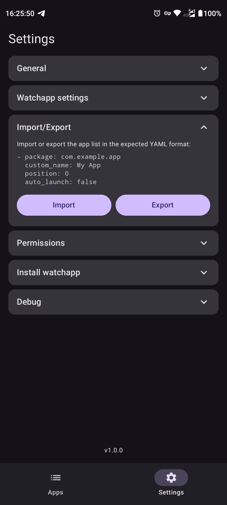
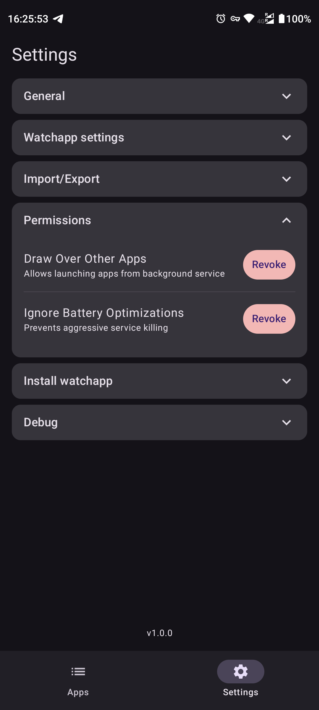
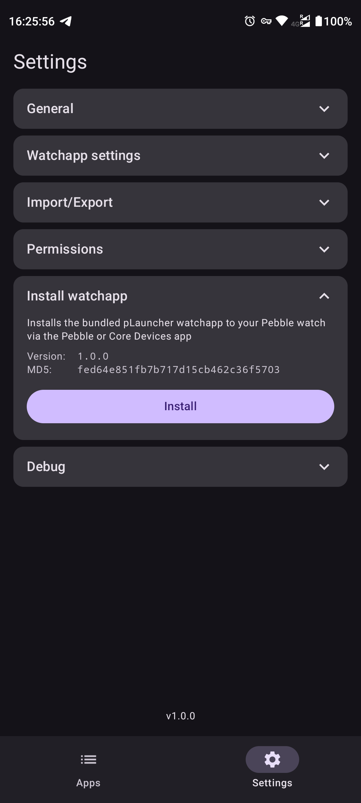
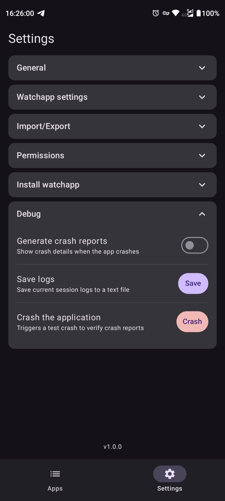

# pLauncher

A Pebble watch app and Android companion app that lets you launch smartphone applications directly from your Pebble watch.

## Overview

pLauncher displays a configurable list of smartphone apps on your Pebble watch. The Android companion app manages the app list and syncs it to the watch. Navigate the list on your watch, select an app, and it launches on your paired phone.

## Screenshots

<details>
    <summary>Watchapp (pbw)</summary>
    
</details>

<details>
    <summary>Companion app (apk)</summary>
    
    
    
    
    
    
    
</details>

## Components

- **Watch App** (`pbw/`): Pebble watch app written in C (Pebble SDK v3). Displays app names and icons, handles navigation and launch requests. See [pbw/README.md](pbw/README.md) for features and details.
- **Companion App** (`apk/`): Android app built with Kotlin and Jetpack Compose. Manages the app list, maintains the Pebble connection via a foreground service, and handles settings. See [apk/README.md](apk/README.md) for features and details.

## How It Works

The companion app manages the list of apps you want to launch. The list is synced to the watch via AppMessage over Bluetooth. On the watch, you navigate through the apps using the UP/DOWN buttons and press SELECT to launch. The companion app receives the launch request and opens the selected app on your phone.

## Quick Start

```sh
# Build the watch app
cd pbw/ && pebble build

# Build the companion app
cd apk/ && ./gradlew assembleDebug
```

See [COMPILE_INSTRUCTIONS.md](COMPILE_INSTRUCTIONS.md) for prerequisites, detailed build steps, icon generation, and troubleshooting.

## Documentation

- [pbw/README.md](pbw/README.md) — Watch app features and details
- [apk/README.md](apk/README.md) — Companion app features and details
- [COMPILE_INSTRUCTIONS.md](COMPILE_INSTRUCTIONS.md) — Complete build instructions for both apps
- [COMMUNICATION_PROTOCOL.md](COMMUNICATION_PROTOCOL.md) — AppMessage protocol specification (watch ↔ companion)

## License

This project is licensed under AGPLv3. See [LICENSE.md](LICENSE.md).
